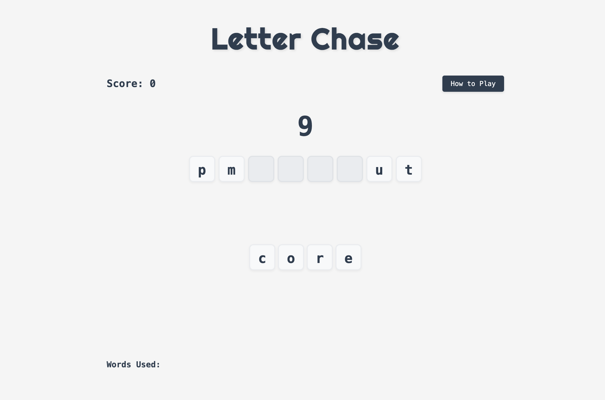
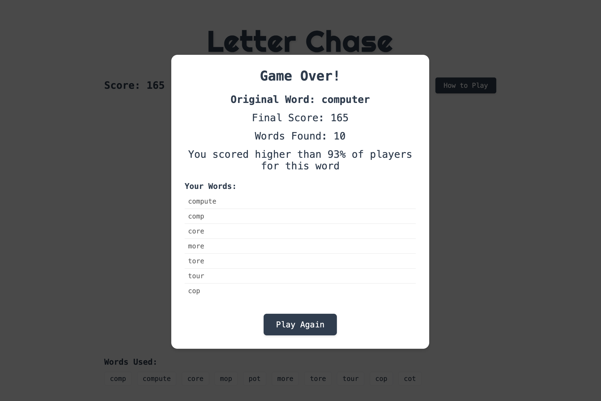

# Letter Chase

A fast-paced word game where players create words from scrambled letters. Test your vocabulary and quick thinking as you race against the clock!

## Game Overview

Letter Chase challenges players to create as many words as possible from a set of scrambled letters. Each word you create adds points to your score and extra time to the clock. The game features a competitive scoring system that compares your performance with other players.

## Features

- **Dynamic Word Formation**: Click letters or use keyboard to form words
- **Real-time Scoring**: Points based on word length (length²)
- **Time Management**: Each word adds time based on its length
- **Competitive Rankings**: Compare your performance with other players
- **Responsive Design**: Play on desktop or mobile devices
- **Visual Feedback**: Animations for correct/incorrect words
- **Word Validation**: Built-in dictionary to ensure valid words
- **Score Tracking**: Persistent score storage with Supabase

## Scoring System

The scoring system is based on two main factors:
1. **Word Length**: Points = length² (e.g., a 4-letter word = 16 points)
2. **Time Bonus**: Each word adds seconds equal to its length

### Percentile Rankings
- First to play a word: "You were the first to play this word!"
- Highest score: "You got the highest score for this word!"
- Other scores: "You scored higher than X% of players for this word"

## How to Play

1. **Start the Game**
   - Click the "Start" button or press Enter
   - You'll see a set of scrambled letters

2. **Form Words**
   - Click letters or use keyboard to form words
   - Press Enter to submit a word
   - Press Backspace to remove the last letter

3. **Score Points**
   - Create longer words for more points
   - Each word adds time to the clock
   - Avoid duplicate words

4. **Game Over**
   - Game ends when the timer reaches zero
   - View your final score and percentile ranking
   - See all words you created, sorted by length

## 🛠️ Technical Details

### Frontend
- HTML5, CSS3, JavaScript
- Responsive design for all devices
- Smooth animations and transitions

### Backend
- Supabase for score storage and retrieval
- Real-time percentile calculations
- Secure API endpoints

### Word Validation
- Built-in dictionary for word verification
- Efficient binary search algorithm
- Anagram validation

